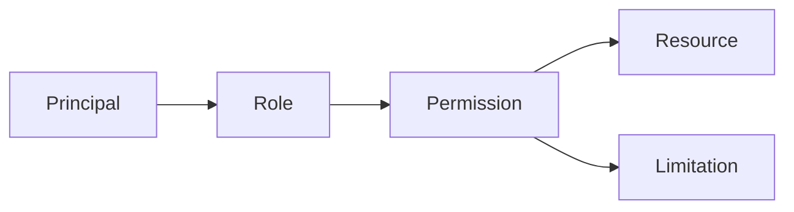

# Opla.Auth

## Description

Opla.Auth is a service that provides authentication and authorization.

Opla provide both API and UI to manage principals, resources, roles and permissions,...

## The philosophy

### Concepts

- **Principal**: a user or an application
- **Resource**: a resource is a thing that can be accessed by a principal
- **Role**: a role is a set of permissions
- **Permission**: a permission is a right to access a resource
- **Limitation**: a limitation is a restriction on a permission

